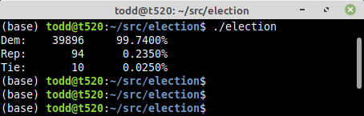

```
/* For each state, the estimate of the Democrat's chances is from the
 * set of Nate Silver's predictions, published during the afternoon of
 * November 2, 2020.
 *
 * Here we apply the strong assumption that each such estimate is
 * correct, and is independent of any of the others.  In other words,
 * we assume that there is no systematic error in the estimates (or
 * for that matter, no error of any kind).
 *
 * We do this not because it is bad to model such things, but simply to
 * compare it to Nate Silver's estimate of the race overall.  Any difference
 * between what we compute with a simple set of Monte Carlo trials, and Nate's
 * prediction, would seem to be due to the model either directly or indirectly
 * trying to take into account these "polling errors" in some way.
 */
```


